<div align="center">

# ನೀರುAI &nbsp;·&nbsp; NeeruAI

### A closed-loop water and heat operating system for India's data centres

**Reduce** the freshwater a data centre needs · **Recover** what it still loses using its own waste heat · **Verify** every litre before it is reused or released

<br>

`prototype` · `zero dependencies` · `single HTML file` · `physics-driven simulation`

<br>

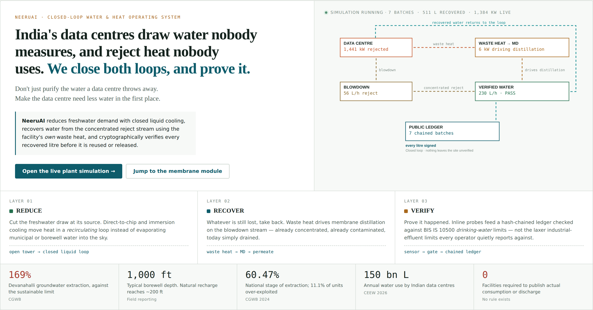

</div>

<br>

> India's data centres use roughly **150 billion litres of water a year.**
> Not one of them is required to tell you how much.

A groundwater No Objection Certificate fixes an extraction cap, and after that nothing happens. No agency verifies that the water source named in an environmental clearance matches what is actually being drawn on site. The EU mandates disclosure; India does not. Karnataka's 2022 Data Centre Policy required no water report at all.

Meanwhile the Devanahalli block outside Bengaluru — where a great deal of new capacity is going — sits at **169% of its sustainable groundwater extraction**. Borewells reach 300 m. Natural recharge reaches about 60 m.

This repository contains a working prototype of a system built for that gap.

---

## Contents

- [The idea in one minute](#the-idea-in-one-minute)
- [Run it](#run-it)
- [Inside the console](#inside-the-console)
- [The digital twin](#the-digital-twin)
- [Four things to try](#four-things-to-try)
- [How the simulation works](#how-the-simulation-works)
- [Data architecture](#data-architecture)
- [Repository layout](#repository-layout)
- [Documents](#documents)
- [What is real and what is simulated](#what-is-real-and-what-is-simulated)
- [Roadmap](#roadmap)
- [References](#references)

---

## The idea in one minute

Most discussion of this problem is framed as *seawater cooling versus groundwater*. That describes a choice that does not exist yet — seawater cooling in India is **proposed, not deployed**, and the environmental clearance for the flagship coastal project names no water source at all. The real contest today is between groundwater, municipal supply, treated non-potable water and recycled blowdown, and almost nobody discloses which they use.

NeeruAI attacks the problem in three layers.

| | Layer | What it does | Mechanism |
|:--:|---|---|---|
| 🟢 | **REDUCE** | Cuts the freshwater draw at its source | Closed-loop liquid cooling — direct-to-chip or immersion — instead of open evaporative towers. The coolant **recirculates**; it is not consumed. In the simulation this alone cuts water leaving the site by **~87%**, before a drop is recovered. |
| 🔵 | **RECOVER** | Takes back what is still lost | The facility's own waste heat drives **membrane distillation** on the blowdown / RO-reject stream — already concentrated, already contaminated, today simply drained. |
| 🟣 | **VERIFY** | Proves it happened | Inline probes → an automated quality gate against **BIS IS 10500 drinking-water** limits (not the laxer effluent limits) → a **hash-chained ledger** anyone can independently recompute. |

The third layer is the actual product. Hardware alone does not create accountability, and no hardware vendor is building this.

**Why membrane distillation and not reverse osmosis?** RO is pressure-driven and runs on electricity — waste heat is worthless to it. MD is thermally driven: only water vapour crosses the hydrophobic membrane, and fluoride, nitrate and dissolved salts are non-volatile, so they physically cannot follow. MD is the only mainstream separation that actually consumes the byproduct the system claims to repurpose.

**Why software rather than better hardware?** Recoverable heat tracks IT load, and IT load across India's mixed air- and liquid-cooled fleet is volatile and site-specific. A forecasting and dispatch layer is what makes *any* treatment hardware usable — an RO skid, an existing ETP, a municipal plant, a future MD unit.

---

## Run it

No build step, no package manager, no server. The console is a single self-contained HTML file.

```bash
git clone https://github.com/Lakshya0104/NeeruAI.git
cd NeeruAI
open prototype/neeruai-console.html        # macOS
# xdg-open prototype/neeruai-console.html  # Linux
# start   prototype/neeruai-console.html   # Windows
```

That is the whole setup. The simulation warm-starts with about fourteen hours of history, so it opens in a realistic running state rather than an empty shell.

| File | What it is |
|---|---|
| [`prototype/neeruai-console.html`](prototype/neeruai-console.html) | The console — six pages, live simulation |
| [`prototype/neeruai-demo-guide.html`](prototype/neeruai-demo-guide.html) | Presenter's handbook — every panel explained, plus a demo script |

Requires a modern browser (Chrome, Edge, Firefox or Safari). Uses Canvas, SVG and `color-mix()`. Renders in light or dark theme depending on your system setting.

---

## Inside the console

Six pages that follow the water and the heat through the plant, in order.

### Stage 01 — Data centre & cooling

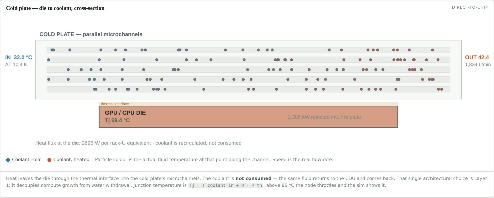

A cutaway of a cold plate. The moving particles are coolant: **their colour is the real fluid temperature** at that point along the microchannel, interpolated between the live supply and return values, and **their speed is the real flow rate**. Junction temperature is computed from coolant inlet plus loop rise plus the die-to-coolant drop; push the load to 100% and top-of-rack nodes throttle.

Alongside it, a rack elevation shaded by actual per-node temperature, and a water balance comparing open evaporative tower against closed liquid loop at the current heat load.

### Stage 02 — Heat recovery

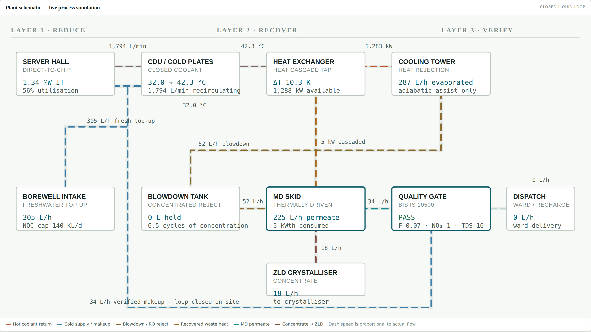

The whole plant on one sheet, banded by layer. Every pipe animates at a speed proportional to its **actual flow**, and fades when a stream goes idle. Hot coolant lines shift colour with return temperature.

Below it: a **heat cascade** that highlights which grade band the coolant return currently sits in — below ~38 °C the driving force collapses and the dispatch engine idles the skid — a counter-flow heat exchanger profile with live LMTD, and the heat availability chart with a 30-minute forecast.

### Stage 03 — Membrane distillation

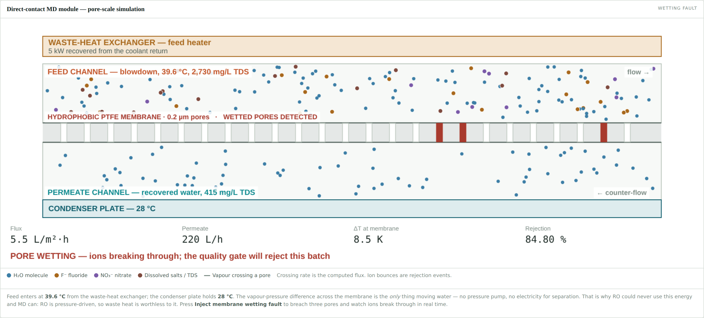

The centrepiece, simulated at the pore. Hot concentrated blowdown flows across a hydrophobic PTFE membrane with 0.2 µm pores; the dashed vertical transits are water molecules crossing **as vapour**; the coloured particles bouncing off the membrane face are fluoride, nitrate and dissolved-salt rejection events.

Shown here mid-**wetting fault** — three pores breached, ions convecting through, rejection collapsed from 99.4% to 84.8%.

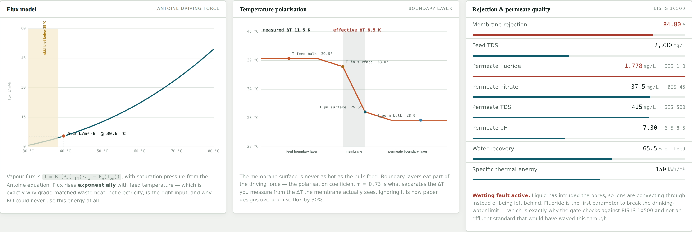

The model behind the animation: flux from the Antoine vapour-pressure relation, the temperature profile across both boundary layers separating *measured* ΔT from the *effective* ΔT the membrane actually sees, and permeate chemistry against BIS IS 10500.

### Stage 04 — Verification

<p align="center">
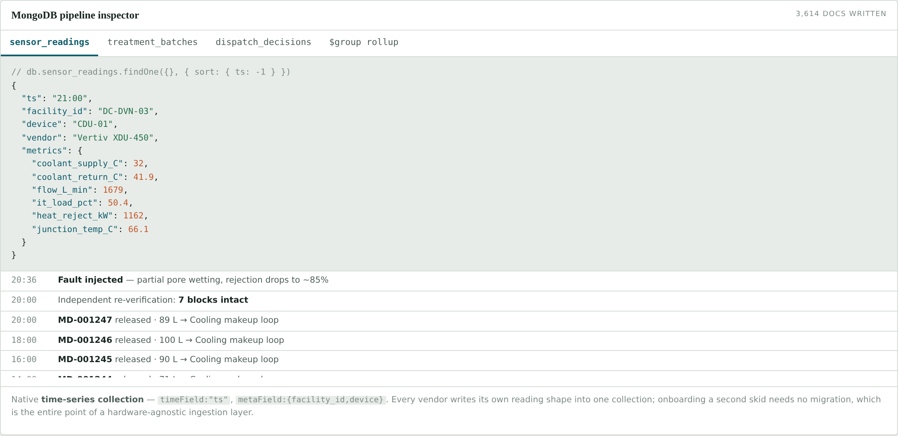
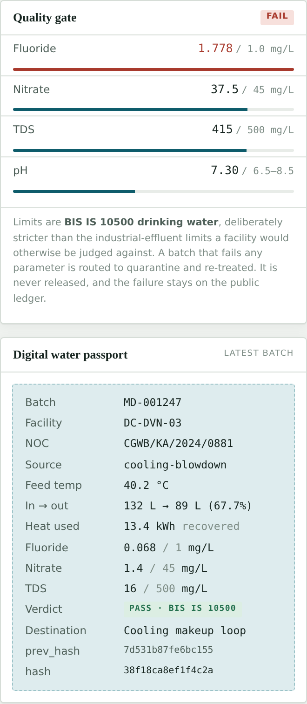
</p>

The quality gate, the digital water passport for the latest batch, the hash-chained ledger, and a pipeline inspector showing the document shapes being written. Failed batches are routed to quarantine — **and they stay on the ledger.** A log that only records successes is not a verification system.

### Stage 05 — Dispatch & compliance

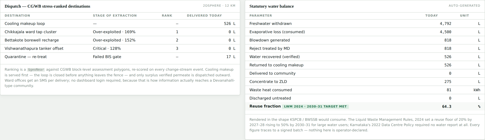

Destinations ranked by CGWB stage of extraction, with cooling makeup served first so the loop closes before anything leaves the fence. Then the statutory water balance in the shape KSPCB or BWSSB would actually consume — note that *withdrawn* and *consumed* are separate rows, the distinction most corporate reporting blurs.

---

## The digital twin

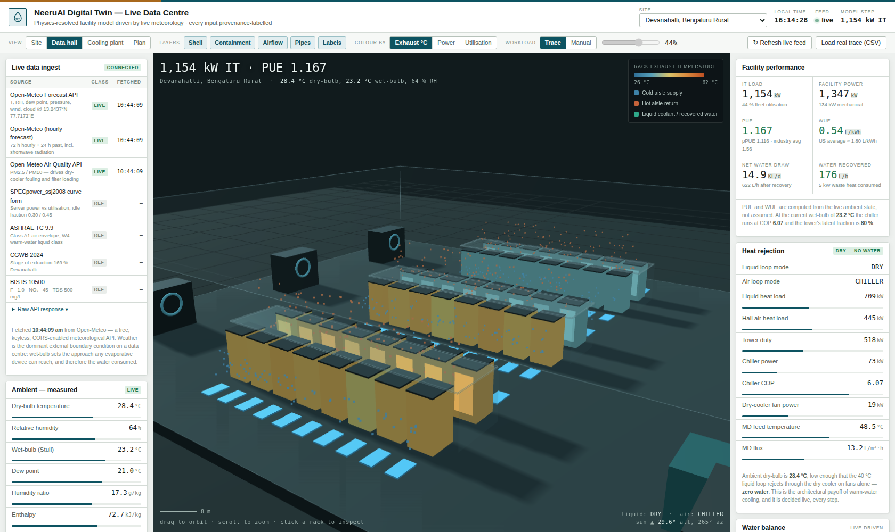

A **live, physics-resolved 3D replica** of a data centre, driven by real meteorology. Open
[`digital-twin/neeruai-digital-twin.html`](digital-twin/neeruai-digital-twin.html) — Three.js is vendored
into the file, so the only thing it needs the network for is the live weather feed.

### Where the data actually comes from

There is no public live telemetry feed from a real data centre. There *is* a live feed of the variable that
dominates a data centre's cooling behaviour — **the weather at the site.** Ambient wet-bulb sets the approach
any evaporative device can reach, which sets evaporation, which sets water consumption and PUE. Every input is
labelled in the UI with its class, and the raw API response is inspectable in the panel:

| Class | Source | What it drives |
|---|---|---|
| <b>LIVE</b> | Open-Meteo Forecast API — keyless, CORS-enabled | Dry-bulb, RH, dew point, pressure, wind, cloud, shortwave radiation at the site's real coordinates |
| <b>LIVE</b> | Open-Meteo hourly (72 h forward, 24 h past) | The 48-hour facility projection |
| <b>LIVE</b> | Open-Meteo Air Quality API | PM2.5 / PM10 — dry-cooler fouling and filter loading |
| <b>REPLAY</b> | Workload trace | Fleet utilisation. **Load a real trace** (Azure, Alibaba or Google cluster data) as CSV at runtime |
| <b>REFERENCE</b> | SPECpower_ssj2008 curve form, ASHRAE TC 9.9, CGWB 2024, BIS IS 10500 | Power-vs-utilisation shape, thermal envelopes, extraction stage, water quality limits |

If the live fetch fails the twin falls back to the **last successful real fetch** cached in `localStorage`,
labelled as cached — it never silently substitutes invented numbers.

### What is modelled

Six rows, 48 racks. Rows A–C are air-cooled legacy; rows D–F are direct-to-chip liquid — a deliberately
**mixed fleet**, because that is the Indian reality, and the two halves reject heat through completely
different paths.

- **Per rack** — SPECpower-shaped power curve, airflow from `ṁ = Q/(c_p·ΔT)`, inlet temperature raised by
  recirculation (3 % contained, 20 % not), exhaust temperature, and junction temperature through a
  0.045 K/W die-to-fluid resistance. Click any rack to inspect its nodes.
- **Psychrometrics** — wet-bulb by Stull's relation from the live dry-bulb and RH, humidity ratio, enthalpy and
  moist-air density, plotted live on a psychrometric chart against the ASHRAE A1 envelope.
- **Heat rejection, decided every step from live ambient** — the 40 °C liquid loop dry-cools on fans alone
  when ambient permits (**zero water**), falls back to adiabatic assist when it doesn't; the air loop runs a
  water-side economiser only if wet-bulb allows, otherwise a chiller whose COP is derated from the live
  condensing temperature.
- **Water** — tower evaporation from the latent fraction of duty at the measured wet-bulb, blowdown from
  cycles of concentration, then the RO + MD recovery island.
- **Metrics** — PUE, pPUE and **WUE in L/kWh**, all computed rather than assumed.
- **Sun** — the scene's lighting uses the real solar altitude and azimuth for the site's coordinates and the
  current time.

### The 48-hour projection

Because the feed carries a real hourly forecast, the twin does genuine predictive work — projecting wet-bulb,
cooling mode and water draw forward and naming the cheapest window to schedule deferrable compute.

<p align="center">
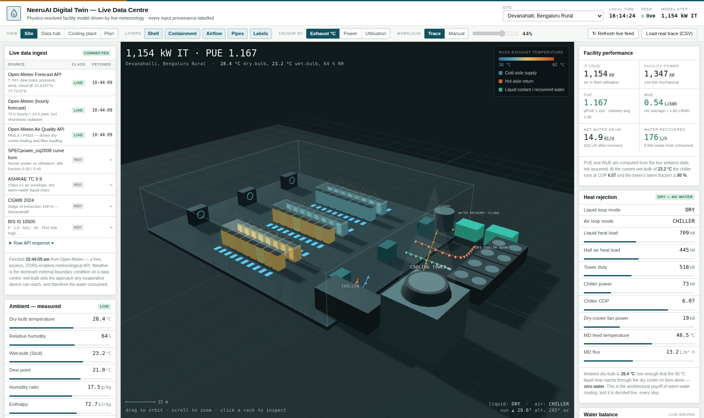
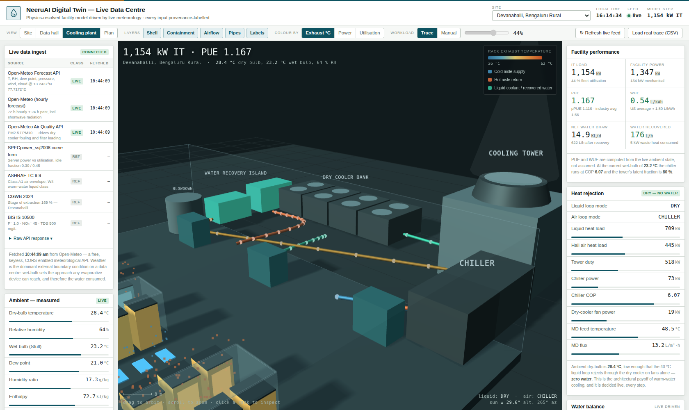
</p>

### Running it

```bash
open digital-twin/neeruai-digital-twin.html
```

If your browser blocks the API call from a `file://` origin, serve the folder instead:

```bash
python3 -m http.server 8000    # then open http://localhost:8000/digital-twin/
```

Drag to orbit · scroll to zoom · click a rack to inspect it. Switch sites in the masthead — five real
Indian locations with real coordinates, so each pulls genuinely different live weather.

---

## Four things to try

The controls in the toolbar are the demonstration. In order:

**1 · Toggle the cooling architecture** → *Stage 01*
Switch between open evaporative tower and closed liquid loop. Evaporation factor, cycles of concentration and coolant supply temperature all change, and the water balance collapses. Roughly **87% less water leaves the site**. That is Layer 1, demonstrated rather than asserted.

**2 · Inject an AI training burst** → *Stage 02*
IT load jumps 30 points. On the chart, the dashed forecast segment moves **before** the measured line does — the dispatch engine ramping the skid ahead of the heat instead of chasing it.

**3 · Inject a membrane wetting fault** → *Stage 03*
Three pores turn red. Ions begin breaking through. Rejection falls 99.4% → 84.8%, permeate fluoride crosses the 1.0 mg/L limit, and on *Stage 04* the batch is quarantined instead of delivered to a village.

**4 · Re-verify the hash chain** → *any page*
Recomputes every block's hash and every `prev_hash` link independently, then reports whether the chain is intact. This is the audit a regulator would run — nobody is asked to trust the dashboard.

The facility selector in the masthead switches between four sites, each chosen to make a different argument: the base case, a declared-source mismatch, a well-run counterexample, and a clearance that names no water source at all.

---

## How the simulation works

Nothing in the console is a canned animation. **One physics chain drives all six pages**, which is why changing a control on one page moves every other page consistently.

<details>
<summary><b>The full model — click to expand</b></summary>

<br>

| Quantity | Model | Note |
|---|---|---|
| IT power | `P = MW_IT × load` | Diurnal curve or manual override, smoothed so it ramps |
| Heat rejected | `Q = 0.96 × P` | Essentially all IT power becomes heat |
| Coolant flow | `620 + 2100 × load` L/min | Pump scales with demand |
| Loop ΔT | `ΔT = Q·60 / (ṁ·c_p)` | c_p = 4.18 kJ/kg·K; return = supply + ΔT |
| Junction temperature | `T_j = T_supply + ΔT + 38·load + 5` | Throttles above 85 °C |
| Evaporation | `1.593 × Q × f` L/h | From latent heat ≈ 2260 kJ/kg. f = 1.0 open tower, 0.14 closed loop |
| Blowdown | `evaporation / (CoC − 1)` | CoC = 4.2 tower, 6.5 closed loop |
| MD feed temperature | `T_f = T_return − 2.5 °C` | Heat exchanger loss; permeate side held at 28 °C |
| Polarisation coefficient | `τ = 0.78 − 0.004·(T_f − T_p)` | Bounded 0.55–0.82; boundary layers worsen as ΔT grows |
| Membrane surface temps | `T_fm = T_f − ½(1−τ)ΔT`<br>`T_pm = T_p + ½(1−τ)ΔT` | What the membrane actually sees |
| Vapour pressure | `log₁₀P = 8.07131 − 1730.63/(233.426+T)` | Antoine equation, mmHg → Pa |
| **Flux** | `J = B·(P_w(T_fm)·a_w − P_w(T_pm))` | B = 2.2×10⁻³ L/(m²·h·Pa), area 40 m²; a_w reduced by feed TDS |
| Thermal demand | `150 kWh per m³ permeate` | Typical MD specific energy at GOR ≈ 4 |
| Rejection | `99.42%` nominal, `84.8%` wetted | Degrades slightly above 52 °C feed |
| Permeate quality | `C_perm = C_intake × CoC × (1 − R)` | Concentration first, then rejection — this is why fluoride breaks first |

**Timing.** One tick is 2 simulated minutes, advancing every 340 ms at 1×. A treatment batch is minted every 2 simulated hours on accumulated volume.

**Quality limits.** BIS IS 10500: fluoride 1.0 mg/L, nitrate 45 mg/L, TDS 500 mg/L, pH 6.5–8.5. Deliberately stricter than the industrial-effluent limits a facility would otherwise be judged against.

</details>

The consequence worth understanding: **flux rises exponentially with feed temperature**, which is why grade-matched waste heat is the right energy input, why RO could never use this energy, and why the cooling architecture decision dominates the design.

---

## Data architecture

The system is four workloads that conventionally need four different databases — a high-frequency IoT stream, a polymorphic device-integration layer, a geospatial routing problem, and an append-only audit log with a reporting API on top. The design collapses them into one MongoDB deployment.

| Capability | Where it is used | Why it is load-bearing |
|---|---|---|
| **Time-series collections** | All sensor telemetry | Purpose-built for append-heavy IoT ingest with bucketing and columnar compression. ~69 M documents/day at a 100-facility deployment. |
| **Polymorphic documents** | Hardware-agnostic ingestion | Every vendor's CDU, RO skid or ETP emits a different reading shape. A rigid schema breaks on the second vendor onboarded. **This is the technical meaning of "hardware-agnostic".** |
| **Change streams** | Dispatch + anomaly detection | A new reading *pushes* the scheduler instead of a cron job polling it. Resumable, so a restarted service never drops a reading. |
| **`$setWindowFields`** | Forecast features | Rolling average, `$derivative` for the heat slope, `$percentile` for burst headroom — computed in place, not shipped over the wire. |
| **`2dsphere` + `$geoNear`** | Dispatch ranking | Facility and destination geometry matched against CGWB stress polygons in the same query as the batch data. |
| **Aggregation + `$merge`** | Compliance API | One pipeline produces the statutory water balance, materialised for the regulator's dashboard. |
| **Hash-chained documents** | The ledger | Tamper-evidence with **no blockchain infrastructure** — a transaction against a per-facility chain-head document serialises writes, a unique index makes a fork unpersistable, and the writing role has `insert` and `find` but not `update` or `remove`. |

<details>
<summary><b>Collection map</b></summary>

<br>

```js
facilities         { _id, name, operator, geo: <2dsphere>, cooling_type,
                     noc_number, noc_limit_kld, declared_source, district }

sensor_readings    // time-series: timeField "ts", metaField "source"
                   { ts, source: { facility_id, device_id, device_type, vendor },
                     metrics: { ... }   // open — this is the integration surface
                   }

treatment_batches  { batch_id, facility_id, source, input_L, output_L, recovery_pct,
                     heat_used_kWh, fluoride_mgL, nitrate_mgL, tds_mgL, ph,
                     quality: "PASS" | "FAIL", standard: "BIS IS 10500",
                     destination, height, prev_hash, hash, ts }

dispatch_decisions { facility_id, ts, action, reason, forecast_heat_kW,
                     target: { village, ward, stress_index }, litres }

dispatch_targets   { name, type, geo: <2dsphere>, cgwb: { stage_of_extraction_pct } }

compliance_reports // materialised by $merge, read by regulators

ledger_tips        { _id: facility_id, height, hash }   // serialises the chain head
```

</details>

> **Note.** The prototype **models** this write path and displays the resulting document shapes in its pipeline inspector. It does **not** connect to a live cluster — the ledger and hash chain run entirely in the browser. Wiring it to Atlas is Phase 1 of the roadmap.

The full rationale, with working pipelines and the concurrency-safe ledger transaction, is in [the architecture report](docs/NeeruAI_Project_Submission_MongoDB.pdf) (§5, 13 sub-sections).

---

## Repository layout

```
NeeruAI/
├── prototype/
│   ├── neeruai-console.html          # the console — single file, no dependencies
│   └── neeruai-demo-guide.html       # presenter's handbook
├── docs/
│   ├── NeeruAI_Master_Research_Report.md
│   ├── NeeruAI_Project_Submission_MongoDB.pdf
│   ├── NeeruAI_Mechanical_Project_Proposal.pdf
│   ├── images/                       # figures, also used by the README
│   └── submission-src/               # HTML sources for the two PDFs
└── README.md
```

The PDFs are generated from the HTML in `submission-src/` by headless Chromium. To rebuild one:

```bash
npx playwright open --target=chromium docs/submission-src/proposal.html   # preview
# or render with page.pdf({ format: 'A4', printBackground: true })
```

---

## Documents

| Document | Audience | Pages |
|---|---|---|
| [**Mechanical Project Proposal**](docs/NeeruAI_Mechanical_Project_Proposal.pdf) | Thermal / fluids engineering | 25 |
| [**Project & MongoDB Architecture Report**](docs/NeeruAI_Project_Submission_MongoDB.pdf) | Systems and data architecture | 26 |
| [**Master Research Report**](docs/NeeruAI_Master_Research_Report.md) | Background, policy and sourcing | — |

The **mechanical proposal** is the deepest technical treatment. It reframes the scheme as a hybrid RO–MD recovery island thermally integrated with an ASHRAE W4 warm-water cooling architecture, and justifies the hybrid on the opposing failure regimes of the two separations: along the concentration train the osmotic pressure rises **1.3 → 5.2 → 17.5 bar** while the MD driving force falls **0.8%**. It carries a worked design case for a 2.4 MW facility — energy balance, die-to-coolant resistance network, LMTD and ε-NTU heat exchanger sizing, Knudsen-regime transport with temperature polarisation, module sizing with a feed-temperature sensitivity study — plus a bench-rig validation plan with uncertainty propagation, a budget and a risk register.

---

## What is real and what is simulated

Stating the boundary plainly, because it makes everything else more credible.

**Real.** The physics — heat balance, loop ΔT, evaporation from latent heat, cycles of concentration, the Antoine vapour-pressure relation, temperature polarisation, the flux model, and the concentration-then-rejection chain producing permeate chemistry. The regulatory limits, CGWB extraction figures and reuse targets are as published. The hash chain is genuinely computed and genuinely re-verifiable in the browser. The data model is a real schema you could deploy against.

**Simulated.** The telemetry is synthetic, generated by the model rather than read from a facility. The four facilities are composites assembled from published reporting, not live customers. Membrane coefficients are typical literature values, not measurements from a procured module.

> The plant is simulated, but it is not faked — every number on screen is computed from a physical model, which is why a control changed on one page moves every other page consistently. What a real deployment requires is **calibration, not redesign**.

---

## Roadmap

| Phase | Deliverable |
|---|---|
| **Now** | Console prototype, full physics model, in-browser ledger and audit |
| **1** | Live ingestion from one facility's CDU and existing ETP; Atlas cluster; read-only regulator view |
| **2** | Inline fluoride and conductivity probes on the permeate line; first signed batches; SMS to a ward office |
| **3** | Multi-facility, multi-vendor onboarding; district-level regulator dashboard |
| **4** | Natural-language regulatory query over clearances and telemetry; encrypted multi-tenant regulator view |

Before any of that, the bench work in the mechanical proposal must replace the two assumed coefficients — the membrane distillation coefficient *B* and the polarisation coefficient *τ* — and the assumed ion rejection with measured values.

---

## References

Central Ground Water Board — *Dynamic Ground Water Resource Assessment of India*, 2024 · Council on Energy, Environment and Water, 2026 · Down To Earth, *India's Digital Thirst* (2025) and *Thirsty Data Centres, Thin Regulation* (2026) · Mongabay India · Newslaundry · OpenCity · Nxtra by Airtel ESG Report 2025 · Bureau of Indian Standards, *IS 10500* · WHO *Guidelines for Drinking-water Quality* · Government of India, *Liquid Waste Management Rules 2024* · Government of Karnataka, *Data Centre Policy 2022* · ASHRAE TC 9.9, *Thermal Guidelines for Data Processing Environments* · Alkhudhiri et al., *Desalination* 287 · Lawson & Lloyd, *J. Membrane Science* 124 · Khayet, *Adv. Colloid Interface Sci.* 164 · Springer, *Global Groundwater Contamination by Geogenic Fluoride*, 2026.

Full citations are in the [master research report](docs/NeeruAI_Master_Research_Report.md) and in §14 of the mechanical proposal.

---

<div align="center">
<br>

**Status:** research prototype · **License:** not yet chosen — open an issue if you would like to use this

<sub>Water-neutral claims that cannot be checked are not claims.</sub>

</div>
